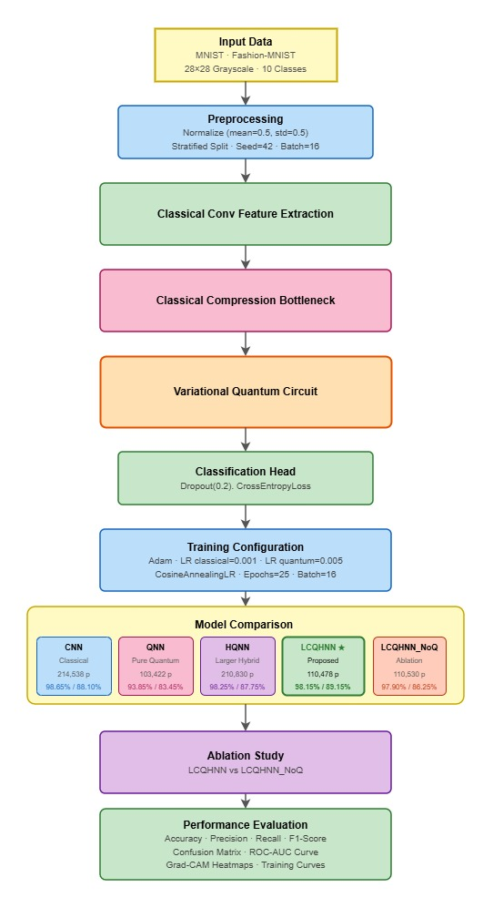
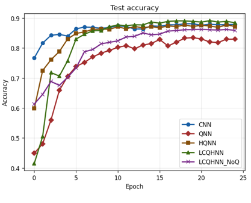
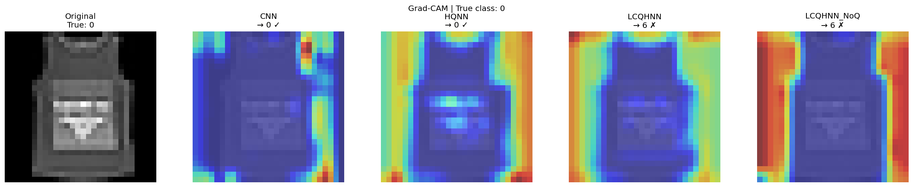
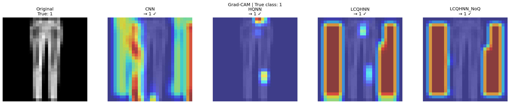
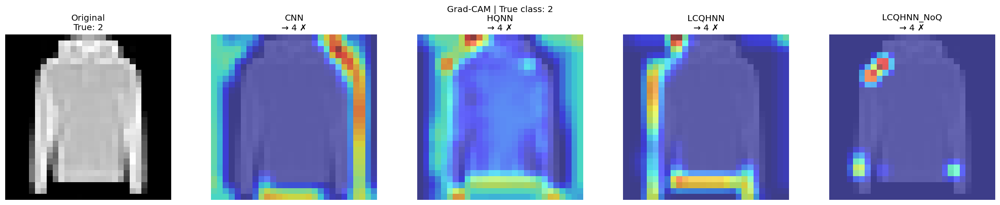
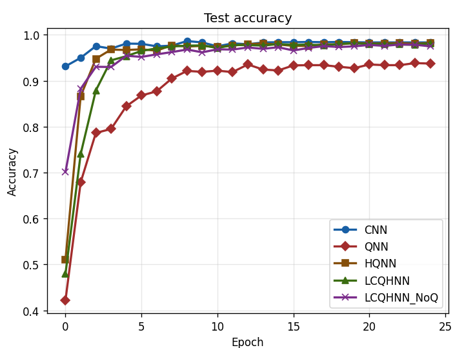
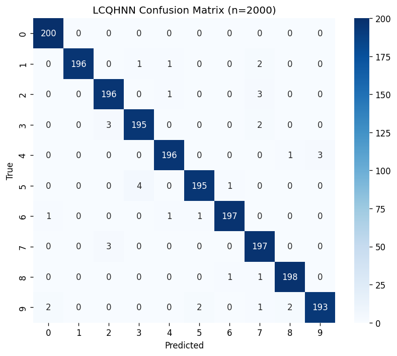
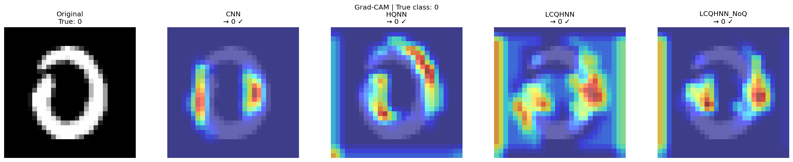
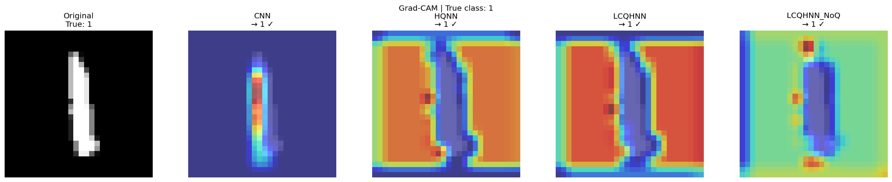
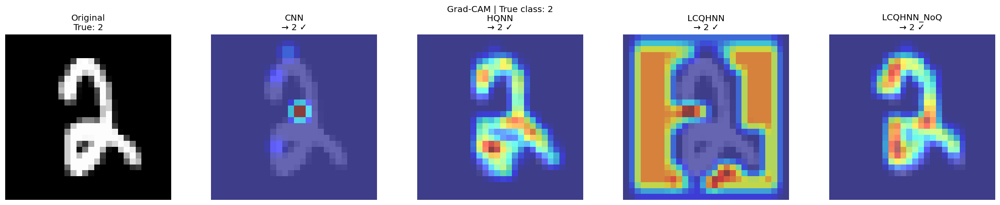

# Design and Implementation of a Lean Classical–Quantum Hybrid Neural Network for Image Classification
## 📌 Project Overview
This project implements a **Lean Classical–Quantum Hybrid Neural Network (CQHNN)** for image classification.  
It integrates **classical deep learning (CNN)** with **quantum machine learning (QML)** techniques to achieve efficient and accurate classification using limited data.
The model is designed to be computationally lightweight and suitable for academic and final-year engineering projects.
---
## 🎯 Objectives
- Design a hybrid classical–quantum neural network
- Apply quantum kernels for enhanced feature representation
- Reduce computational complexity
- Compare classical and quantum-enhanced models
---
## 🗂️ Dataset
- **Fashion-MNIST / MedMNIST**
- Image size: 28×28 (grayscale)
- Multi-class classification
- Reduced sample size for quantum feasibility
---
## 🧠 Models Implemented
- CNN – Convolutional Neural Network  
- QKC – Quantum Kernel Classifier  
- LCQHNN – Lean Classical–Quantum Hybrid Neural Network  
- HQNN – Hybrid Quantum Neural Network  
---
## 🏗️ Methodology
1. Dataset preprocessing and normalization  
2. Feature extraction using CNN  
3. Dimensionality reduction  
4. Quantum feature mapping  
5. Quantum kernel-based classification  
6. Model evaluation and comparison  
### methodology


---
## 🛠️ Technologies Used
- Python 3
- TensorFlow / Keras
- Scikit-learn
- Qiskit
- NumPy, Matplotlib
- Google Colab
---
## ▶️ How to Run
1. Open the notebook in Google Colab  
2. Install dependencies:
   ```bash
   pip install -r requirements.txt
   ```
3. Run all cells sequentially  
---
## 📊 Results
- Hybrid models show competitive accuracy with fewer samples  
- Quantum kernels improve class separability  
- LCQHNN balances efficiency and performance

### Model Results

### Fashion mnist training



### Fashion confusion matrix


### Fashion Gradcam








###  Mnist training


### Mnist confusion matrix




### Mnist Gradcam




   

---
## 📁 Project Structure
```
├── LCQHNN_MNIST_FASHION_FINAL_COLAB.ipynb, LCQHNN_multiclass_for_mnist_final.ipynb
├── README.md
```
---
## 🎓 Academic Use
- Final Year Project / IDP
- Domain: Quantum Machine Learning
- Research-oriented (IEEE aligned)
---
## 📚 References
- MedMNIST Dataset
- Fashion-MNIST Dataset
- Qiskit Documentation
- IEEE Research Papers (2021–Present)
